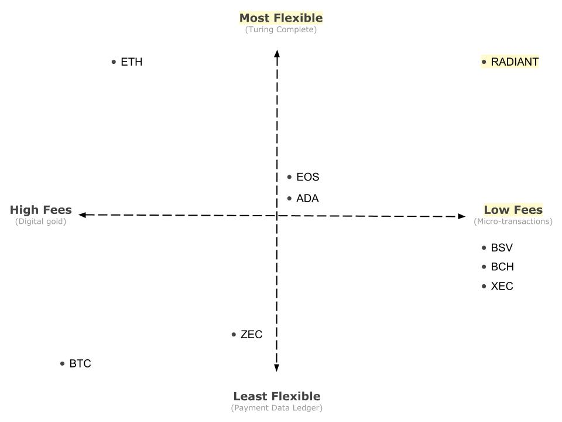
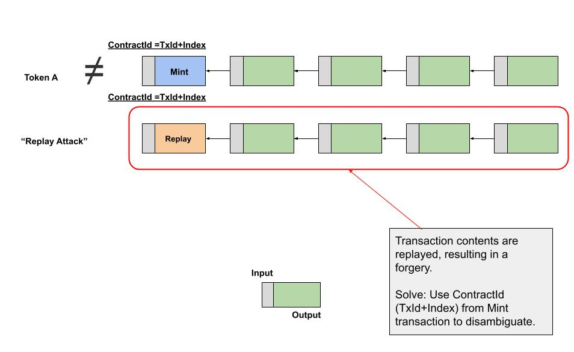
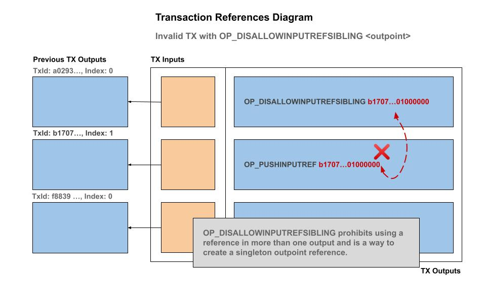
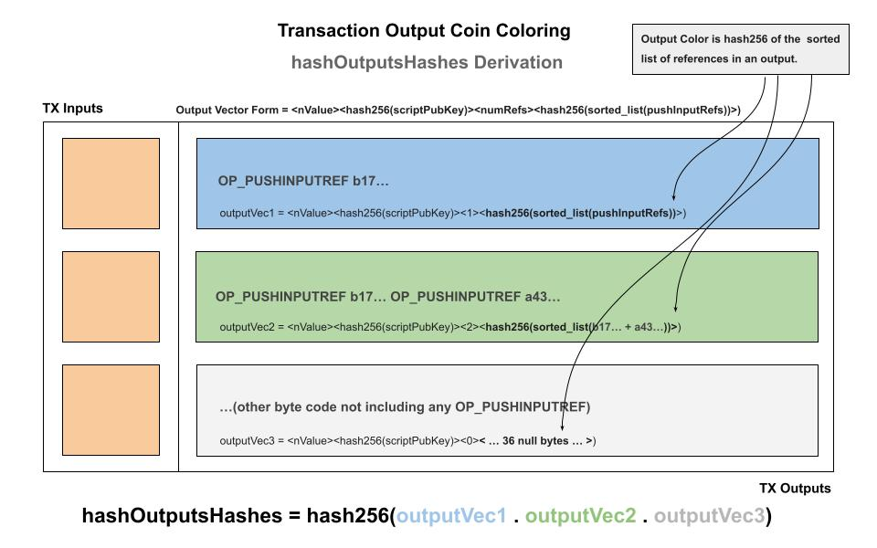
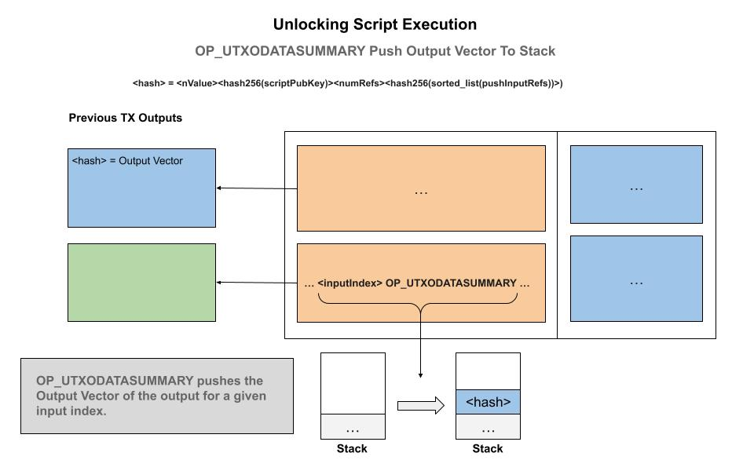
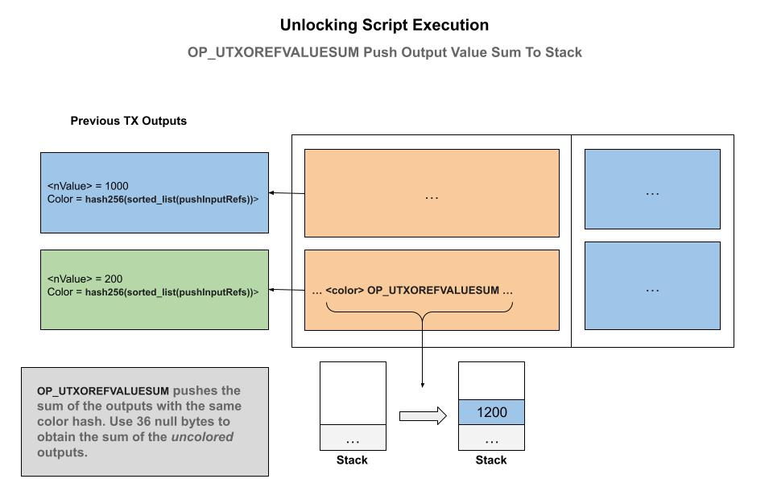
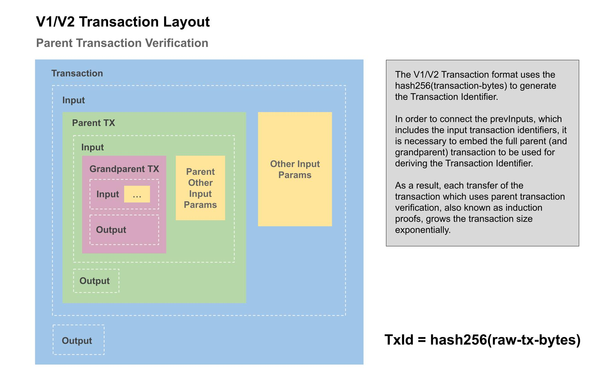
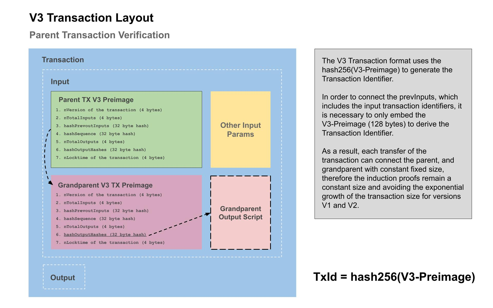
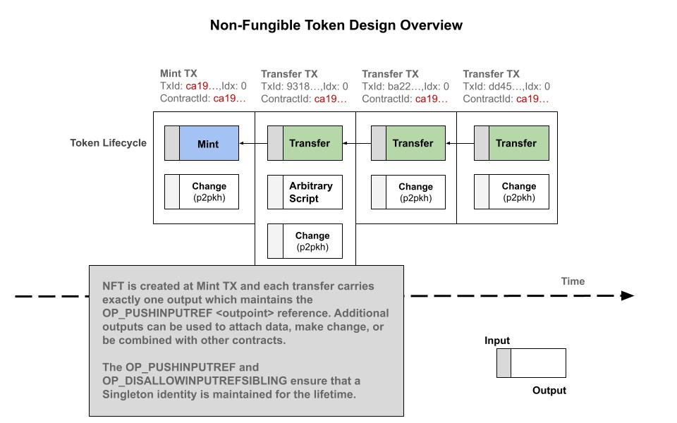

# Radiant Blockchain System Design

The Radiant Developers

August 11, 2022

radiantblockchain.org

**Abstract**

The Radiant network is a peer-to-peer digital asset system that enables direct exchange of value without going through a central party. The original Bitcoin[1] protocol provides what is needed to create a peer-to-peer electronic cash system, but lacks the ability to verify transaction histories and therefore cannot be used to validate digital assets. Digital signatures and output constraints provide part of the solution, but the main benefits are lost if a trusted third party is still required to validate digital assets. The Radiant network itself requires minimal structure, and operates similiarly to the Bitcoin network in timestamping transactions into an ongoing hash-based chain of proof-of-work. We introduce two techniques to validate digital assets using a general purpose induction proof system that operates in constant O(1) time and space. The induction proof system makes it possible to efficiently compose outputs in any manner, without compromising the inherent parallelism and scalability characteristics of the UTXO based architecture. Users can leave and rejoin the network at will and be assured of the integrity and authenticity of their digital assets.

# Introduction  

Commerce with blockchains and digital ledgers has come to rely on issuers and custodians serving as trusted third parties (sometimes referred to as "bridges", "oracles", "secondary layers") to authenticate digital assets and process electronic payments. While the system works well enough for electronic payment-like transactions, it still suffers from the inherent weaknesses of the trust based model for more advanced usages of the blockchain. The high costs of transactions associated with Ethereum Virtual Machines (EVM) based blockchains is due to the limited block space and the inherent limitations of the account based model of processing.

What is needed is an electronic payment system that can also act as a digital asset management system with the performance characterstics of an unspent transaction output (UTXO) blockchain architecture, with the flexibility of an account based blockchain. In this paper, we propose a solution to the problem of blockchain scaling using two novel methods which, independently, provide a general induction proof system capable of authenticating digital assets, emulating account based blockchains, while maintaining the performance characteristics of a UTXO based blockchain such as unbounded scale and parallelism.

The original Bitcoin[1] protocol provides what is needed to create a peer-to-peer digital asset system, but lacks the ability to verify transaction histories and as a result cannot authenticate digital assets. Blockchains such as Bitcoin Cash (BCH) and Bitcoin Satoshi Vision (BSV) attempt to authenticate digital assets via trusted third parties called "oracles" which indexes the relevant transactions. Such solutions, however, prevent the possibility of advanced blockchain contracts since a trusted custodian is required. In order to solve the problem of digital asset authenticity, without using central parties, we introduce two novel methods that operate in constant O(1) time and space. The additional programming instructions creates a general purpose induction proof system. Users and applications need only to verify that the latest digital asset transfer is accepted into a block. 

Radiant is the first unspent transaction output (UTXO) blockchain that solves the key problems that prevented the development of advanced contracts on other blockchains such as Bitcoin, Cardano, and Dash. This breakthrough design revolutionizes what we imagined to be possible with blockchains; Radiant is a Turing Complete high performance layer one blockchain with no need for secondary layers.


<center>Positioning of Radiant relative to popular blockchains.</center>
<br/>

# Problems

There are three problems which make it impractical to use unspent transaction output (UTXO) blockchains as a general purpose digital ledger. The first problem is the ability to arbitrarily constrain the spend conditions &mdash; or forward conditions on all descendant transactions. The second problem is how to efficiently authenticate transaction outputs to ensure they originate from a valid genesis transaction &mdash; this is an essential requirement for many programs, especially to emulate accounts and create fungible tokens. The third problem is coordination and collaboration between contracts &mdash; precise control of message passing between transaction outputs. We will show that all three problems can be solved without compromising performance or the scalability of the UTXO-based blockchain model.

## Contract Constraints

The first obstacle to programming with an unspent transaction output (UTXO) blockchain was a misunderstanding of Satoshi Nakamoto's original design and programming codes available in the original Bitcoin protocol. It is not generally acknowledged but the original Bitcoin blockchain had all of the programming codes necessary for Turing Complete [2] smart contracts. The necessary programming codes were removed from the protocol in the BTC upgrades of 2015. 

The method to impose constraints on spending conditions is to restore all of the original programming codes from Bitcoin and to provide a method to inspect the current transaction context. There are two ways to inspect the current transaction as a type of introspection. The first way is to push the Signature Hash (known as the "SigHash Preimage") onto the stack and use a temporary private key to generate a signature and then apply the `OP_CHECKSIG` operation to validate that the expected SigHash Preimage for the current transaction is valid. The second way is to provide native introspection programming codes that push the relevant transaction component onto the stack for use in the unlocking script.

The key difference with a UTXO blockchain is there are no loops in the programming codes. However in practice any repetition can be simulated with unrolling the loop operations and replicating the logic for the necessary maximum number of repetitions. In this manner, UTXO blockchains can avoid any concept of "execution time cost" and instead estimate the execution cost by using only the transaction script size. For this reason, it is recommended that UTXO blockchains have a sufficiently large maximum transaction size, such as 2 megabytes or more to be able to accommodate any use cases that may need dozens or hundreds of loop iterations.

## Contract Persistent Identity

An electronic coin is defined as a chain of digital signatures. A coin begins at a genesis transaction called a "coinbase" transaction. To transfer a coin, the owner of the unspent output signs the coin with their private key and locks the tokens in a new output which is associated with the public key of the recipient. At each transaction a new transaction identifier and output index is used, which is globally unique. The concept of a "wallet balance" for a user is the sum total of the nominal token units controlled by the user for the unspent outputs for their corresponding public keys. Each coin in essence is uniquely identified by it's most recent unspent output. There is no inherent concept of an "account" or "coin identity".

In unspent transaction output (UTXO) blockchains the native token unit is the only class &mdash; or type and therefore a unique persistent coin identity is not neccesary. It is sufficient to have a different UTXO identity to enumerate the coins that can be spent. However, if we wish to create a different class of tokens, in other words to "color" the native tokens to represent shares, points or any other enumerable type, then we need a way to represent and efficiently validate token class membership. The term "colored coins" have been used to describe an overlay network which mints tokens from a special genesis or minting transaction &mdash; similar to the native coin is emitted from a coinbase.

A custom (or colored) digital coin is defined as a chain of digital signatures anchored at a user defined genesis output. Users may mint or create a custom coin issuance by depositing the desired number of native token units at the output and designating it as a coinbase with 36's 0x00 null bytes as the first push data of the output. The contract logic is constrained such that the subsequent spend of the output must embed the outpoint (transaction id, output index) of the genesis transaction into the first push data (where the 36 0x00 null bytes were in the genesis transaction) for the entire lifecycle of the colored coin. Following this convention combined with the contract constraints, we can see that this tecnique effectively "colors" the native token and can be identified  unambiguously. Additional logic can be added according to the application needs such as how the coins are redeemed or returned back to their native token units. For example the issuer can perform the operation or the token holder can "melt" out the native token unit and effectively destroy the color classification.
The technique of embedding the genesis output forms a globally unique identifier sometimes referred to as asset identifier (or assetId for short) or contract identifier (or contractId for short) that may now be used to identify the coins that belong to that coin class. This identity will form the basis of the advanced usages outlined below.


<center>Diagram 1. Token replay attack </center>
<br/>

There is an outstanding problem however: How can spending transactions ensure that only coins descended from the rightful genesis transaction can be spent and not passed off into spending a forgery that was merely copied?

## Contract Traceability &amp; Authenticity

Recall that an unspent transaction output (UTXO) has no persistent identity, but we can give a persistent identity by following the rule that a user may designate some transaction as a genesis minting event, where the outpoint stands in as the assetId or contractId. However, using this convention it is not sufficient because an attacker can copy one of the intermediate transaction spends and begin a new (albiet forgery) chain of signatures to spoof a coin class and pass it off. Any spending transaction are unable to differentiate between a real output that originated as a valid descendent versus the forgery from a false copy. What is required is a  way to enforce global uniqueness that is unobtrusive and efficient to verify inside a spending script.


<center>Diagram 2. Token man-in-the-middle forgery attack </center>
<br/>

### OP_PUSHINPUTREF <outpoint>: Push reference

We define the programming operation code (OP code) `OP_PUSHINPUTREF <hash>` is defined as valid accordingly:

1. An `OP_PUSHINPUTREF` may appear only in an output and requires exactly 36 bytes immediately after that is treated as a push onto the stack in interpretor context.

2. The transaction containing an output with a `OP_PUSHINPUTREF` is valid if and only if the provided argument is equal to one of the inputs' outpoints being spent or at least one of the inputs' output locking script bytecode also contains the same `OP_PUSHINPUTREF` argument value.

The only way an `OP_PUSHINPUTREF` can first apppear in an output is if the first occurrence is equal to one of the inputs outpoints being spent. In the case of using the above "Persistent Contract Identity", this corresponds to the transaction that contains the 36 0x00 null bytes signifiying a genesis minting coinbase for a custom (colored) coin class. 


<center>Diagram 3. Minting transaction OP_PUSHINPUTREF reference must match outpoint.</center>
<br/>


<center>Diagram 4. Transfer transaction OP_PUSHINPUTREF reference must match one of the previous outputs scripts being spent.</center>
<br/>


<center>Diagram 5. Invalid TX with no matching previous output script or outpoint.</center>
<br/>

We demonstrate that this simple rule is sufficient to form a globally unique identifier, and carries no overhead &mdash; as in no extra indexes or lookup tables are required. Only a transaction and it's immediate parent inputs are needed to validate authenticity &mdash; all of the data is available to the virtual machine at the time of the unlocking script evaluation and also into accepting the transaction into the mempool and subsequently into a block.

As long as at least one of the input coins has a valid 36 byte hash &mdash; either as the outpoint itself (significanty the first genesis chain of the colored coin) or as one of the scripts containing the reference, then the identity exists as a persisted identity. To terminate the lineage, simply omit passing on the reference and that terminates the ability to use that unique identifier in any other UTXO forever.

Although this single OP code is sufficient, there are a handful of additional OP codes that provide flexibility for the programmer and are described next which complement `OP_PUSHINPUTREF`.

### OP_REQUIREINPUTREF <outpoint>: Require reference

The `OP_REQUIREINPUTREF` functions identically to `OP_PUSHINPUTREF` except it does not pass on the reference identity to the output in which it appears. This is useful for demanding that at least one input is of a specific coin class &mdash; but without passing down the reference immediately. 


<center>Diagram 6. OP_REQUIREINPUTREF functions the same as OP_PUSHINPUTREF but without pushing the reference to the current output.</center>
<br/>

### OP_DISALLOWPUSHINPUTREF <outpoint>: Disallow reference in output

To disallow the use of a `OP_PUSHINPUTREF` in an output, the `OP_DISALLOWPUSHINPUTREF` may be used. This is a useful OP code for smart contracts which leave open the outputs to be used in various contexts, but allows the contract creator to restrict passing down a reference, for example in custom change outputs.


<center>Diagram 7. OP_DISALLOWPUSHINPUTREF disallows usage of a specific reference. </center>
<br/>

### OP_DISALLOWPUSHINPUTREFSIBLING <outpoint>: Disallow reference in sibling outputs

Similar to `OP_DISALLOWPUSHINPUTREF`, disallow specific outputs in any sibling outputs for the specific reference. This effectively prohibits using a reference in more than one output and is a way to create a singleton outpoint. By using `OP_DISALLOWPUSHINPUTREFSIBLING` in an output we can create a simple and powerful Non-Fungible Token (NFT) contract which functions with `SIGHASH_SINGLE` signature flag.


<center>Diagram 8. OP_DISALLOWPUSHINPUTREFSIBLING: Disallow usage of a specific reference in all other outputs than the one in which this instruction appears.</center>
<br/>

### OP_REFHASHDATASUMMARY_UTXO: Push UTXO data summary

Provides a summary of the contents of an output being spent in the current transaction. Takes the top element of the stack which is the index of the input being spent and then pushes the hash256 of the information about the UTXO being spent: `hash256(<nValue><hash256(scriptPubKey)><numRefs><hash256(sorted_list(pushInputRefs))>)`. During unlocking script evaluation, the relevant data of an UTXO is able to be accessed and incorporated into the logic. 


<center>Diagram 9. OP_REFHASHDATASUMMARY_UTXO: Output coloring diagram </center>
<br/>


<center>Diagram 10. OP_REFHASHDATASUMMARY_UTXO: Push to stack the summary of an input being spent. </center>
<br/>

### OP_REFHASHVALUESUM_UTXOS: Push value sum of UTXO by reference (color)

This programming code accepts a hash256 of the 36 byte reference and pushes onto the stack the sum total of all of the inputs that matches that reference coloring. This is useful for saving data and for quickly assessing the total inputs and the values input to the transaction.

This is very useful for building a compact fungible token accounting system as we shall see below.


<center>Diagram 11. OP_REFHASHVALUESUM_UTXOS: Push to stack the total sum of the inputs which match a specific reference hash</center>
<br/> 

## Contract Authenticity via Induction 

Another method for solving the traceability and authenticity problem is to allow the embedding of the parent transaction into an unlocking script. In this manner, we can perform induction proofs and guarantee that a transaction output originated from a valid genesis minting event.

The general principle in mathematical induction is to prove that some statement P(k) holds for k = 0, k = 1, k = 2... and so on that generally P(k) holds for P(0) and P(k + 1).

In the case of smart contracts, we wish to prove that a given transaction is valid in the base case, as in it descends from valid parent, the base case P(0), and in the inductive case that the grand parent also satisfies the condition, which is the P(k + 1) step. 

With an induction proof it is impossible to forge an intermediate transaction because the grand parent transaction will not be of the required origination.


<center>Diagram 12. Verify the parent and grand parent to identify forgery.</center>

<br/>
This system is not practical however because each time the output is spent a full copy of the parent (and it's parent) transaction must be embedded to calculate the transaction identifier. This leads to a factorial, or exponential, explosion in transaction size. It is not practical since after only about a dozen spends, the transaction size starts to exceed 1 GB and continues growing exponentially.
<br/>


<center>Diagram 13. Transaction Contents with Embedded Parents</center>
<br/>
To solve this problem of exponential transaction size growth we leverage the "nVersion" field provided by the transaction format. Bitcoin has version 1 and version 2 transactions already and we simply create a version 3 that uses a different transaction identifier generation algorithm instead of hashing the entire bytes of the transaction. The version 3 transaction format is identical except the transaction id is generated from an intermediate fixed size data structure that compresseses the transaction contents into a preimage &mdash; that can be embedded in locking scripts to derive the transaction id and avoid the exponential transaction size problem.

### Transaction Identifier Version 3

Similar to the Signature Hash algorithm which generates a "Sighash Preimage", we produce a TxId preimage according to the following components and fields of a transaction.

> 1. nVersion of the transaction (4 byte little endian)
> 2. nTotalInputs (4 byte little endian)
> 3. hashPrevoutInputs (32 byte hash)
> 4. hashSequence (32 byte hash)
> 5. nTotalOutputs (4 byte little endian)
> 6. hashOutputHashes (32 byte hash)
> 7. nLocktime of the transaction (4 byte little endian)

<center>Diagram 14. Transaction Identifier Version 3 Preimage</center>
<br/>

By incrementing the nVersion field, we introduce a way to compress an entire transaction into a fixed size (128 bytes) that can be pushed onto the stack, and hashed to arrive at the Transaction identifier, and therefore solving the problem of exponential size increase from from the embedded parent transactions in the induction proofs.


<center>Diagram 15. Transaction Identifier Version 3 Preimages with Embedded Parents</center>
<br/>

Notice that this system itself is sufficient to create arbitrary induction proofs and is general purpose. This is a second method in which arbitrary induction proofs may be created in addition to the already discussed `OP_PUSHINPUTREF` technique.
 
## Signature Hash Algorithm Upgrade

Building on the Transaction Id preimage the technique of segmenting the outputs, we can upgrade the default Sighash algorithm with an additional field called `hashOutputsHashes` to make it easier to constrain the outputs and save space and logic.

> 1. nVersion of the transaction (4 byte little endian)
> 2. hashPrevouts (32 byte hash)
> 3. hashSequence (32 byte hash)
> 4. outpoint (32 byte hash + 4 byte little endian)
> 5. scriptCode of the input (serialized as scripts inside CTxOuts)
> 6. value of the output spent by this input (8 byte little endian)
> 7. nSequence of the input (4 byte little endian)
> 8. hashOutputsHash (32 byte hash)
> 9. hashOutputs (32 byte hash)
> 10. nLocktime of the transaction (4 byte little endian)
> 11. sighash type of the signature (4 byte little endian)

<center>Diagram 16. Radiant Signature Hash Preimage Fields.</center>

This is useful because the other sibling outputs do not need to be included and a hash can be used for the outputs that are not of interest. There is still the color of the push references so that we can assert whether the other outputs contain a valid color, but without requiring the full script to be pushed.

## Contract Design Patterns

With the `OP_PUSHINPUTREF` and TxId Version 3 constructs, we are in a position to define various contract collaboration design patterns. together these patterns will be used in account emulation, non-fungible tokens (NFTS), fungible tokens (FTs) and other programs. 

### Non-Fungible Tokens (NFT)

> <b>Definition:</b> A "Non-Fungible Token" is a uniquely-identified object in which it’s essential properties are conserved

We present a simple, yet powerful, design pattern called a Non-Fungible Token (NFT). Programs will recognize this by another name called a _Singleton_ object. An NFT, or Singleton, guarantees that only one instance of an object can ever exist and is unique identified by a stable persistent identity. Most usages of the term _Non-Fungible Token_ have centered around _digital collectibles_, however that need not be the case &mdash; the reason for that focus has to do with the high-gas fees on Ethereum and the speculative nature of digital artwork.

In the Radiant blockchain, we use the term _Non-Fungible Tokens_ to refer to a uniquely identifable object, or _colored coin_, which maintains some essential properties in addition to being unambiguously traceable through the blockchain. This is a basic building block and design pattern that will appear in more complex contracts, and here we present a simple, yet very powerful, construction below to start.


<center>Diagram 17. Non-Fungible Token Design Overview.</center>

<br/>


<center>Diagram 18. Non-Fungible Token Output Design</center>

<br/>

Non-Fungible Token Pseudo-code:
```
contract NFT {

    // Asset identifier
    bytes assetId;
    
    // Current owner is the second push data
    Ripemd160 currentOwnerAddress;      

    public function unlock(
        SigHashPreimage txPreimage, 
        bytes outputSats, 
        bytes newOwnerAddress, 
        bool isMelt, 
        Sig senderSig, 
        PubKey unlockKey
    ) {
        require(hash160(unlockKey) == this.currentOwnerAddress);
        require(checkSig(senderSig, unlockKey));
        
        // Initial assetId is 36-bytes nulls(0x00 bytes)
        bytes actAssetId = (this.assetId == num2bin(0, 36) ? 
            txPreimage[ 68 : 104 ] : this.assetId);
        
        bytes lockingScript = SigHash.scriptCode(txPreimage);
        
        // The default usage is to update/transfer
        if (!isMelt) {
            require(
                hash256(
                    outputSats +

                    // Define length of output
                    b'fd' + num2bin(len(lockingScript, 2)) +
                    
                    // OP_PUSHINPUTREF <assetId>
                    b'd0' + actAssetId +
                    
                    // New owner (20 bytes)
                    b'14' + newOwnerAddress +    

                    // OP_DISALLOWPUSHINPUTREFSIBLING <assetId>       
                    b'd3' + actAssetId + 

                    // Get entire locking script after the push vars 
                    // 95 = 1+36 + 1+20 + 1+36
                    lockingScript[95 : ]                
                )
                ==
                // Compare to HashOuts
                txPreimage[len(txPreimage) - 40 : len(txPreimage) - 8] 
            );
        } else {
            // Melt the NFT back and destroy the reference

            // Use OP_DISALLOWPUSHINPUTREF and 
            // OP_DISALLOWPUSHINPUTREFSIBLING 
            // to prohibit the reference from being passed along
            
            require(
                hash256(
                    // Hardcode len '4b' is 57 bytes (1 + 1 + 36 + 1 + 36)
                    // 'd2' is OP_DISALLOWPUSHINPUTREF
                    // 'd3' is OP_DISALLOWPUSHINPUTREFSIBLING
                    b'00000000000000004b6ad2' + activeAssetId + 
                    b'd3' + activeAssetId 
                )
                ==
                // Compare to HashOuts
                txPreimage[len(txPreimage) - 40 : len(txPreimage) - 8]
            );  
        }
        require(Tx.checkPreimageOpt_(txPreimage));
    }
}

```
<center>Diagram 19. Non-Fungible Token Pseudocode</center>

### Accounts

> <b>Definition:</b> An "Account" is an object that manages a wallet balance while maintaining an addressable stable unique identifier. 

One of the main difficulties in working with a UTXO-based blockchain is there is no protocol level concept of "wallet balance", and instead infrastructure providers and wallet services present a summary balance derived from the total value of all the individual outputs controlled by a key. Account-based blockchains also simplify specific types of problems and contracts, but trade-off performance and privacy to achieve it's aims. 

We present a simple design pattern to emulate accounts using one or more outputs which gives the user and developer a stable unique identifier across transactions in the blockchain. It is built using the Non-Fungible Token design pattern, and demonstrates that UTXO-based blockchains are perfecty equipped to emulate accounts with the same level of control, but with much higher performance characteristics.

Recall that in the Non-Fungible Token design pattern, the stable identifier _ContractId_ (also sometimes referred to as _AssetId_) is derived from the outpoint of the minting transaction.  The same ContractId is used as the public account identifier and can be treated as a wallet balance. We present below pseudo code for a smart contract that implements all the method associated with accounts: deposit, withdraw, changeOwner, and close the account. 

```
contract Account {

    bytes assetId;
    Ripemd160 currentOwnerAddress;
    bytes disallowAssetIdNotUsed;
 
    static function createSingletonOutput(
        SigHashPreimage txPreimage, 
        int amount, 
        bytes assetId,
        bytes address
    ): bool {
        bytes activeAssetId = (assetId == num2bin(0, 36) ? 
            txPreimage[ 68 : 104 ] : assetId);
        bytes lockingScript = SigHash.scriptCode(txPreimage);
        require(amount > 0);
        require(
                hash256(
                    // Add the deposit amount to the existing balance
                    num2bin(SigHash.value(txPreimage) + amount, 8) +
                    
                    b'fd' + num2bin(len(lockingScript), 2) +

                    // OP_PUSHINPUTREF <assetId>          
                    b'd0' + activeAssetId +    

                    // Address/owner (20 bytes)     
                    b'14' + address +

                    // OP_DISALLOWPUSHINPUTREFSIBLING <assetId>               
                    b'd3' + assetId +    

                    // Get entire locking script after the push vars           
                    // 95 = 1+36 + 1+20 + 1+36
                    lockingScript[95 : ]            
                )
                ==
                txPreimage[len(txPreimage) - 40 : len(txPreimage) - 8] // HashOuts
        );
        require(Tx.checkPreimageOpt_(txPreimage));
        return true;
    }

    // Deposit to account
    // Anyone can spend this input and deposit funds into 
    // the account, but only the owner can withdraw funds.
    public function deposit(
        SigHashPreimage txPreimage, 
        int amount
    ) {
        require(amount > 0);

        require(
            Account.createSingletonOutput(
                txPreimage, 
                SigHash.value(txPreimage) + amount, 
                this.assetId, 
                this.currentOwnerAddress
            )
        );
    }

    // Withdraw from account
    // The current owner can withdraw from the account
    // via any other outputs.
    public function withdraw(
        SigHashPreimage txPreimage, 
        int amount,
        Sig senderSig, 
        PubKey unlockKey
    ) {
        require(hash160(unlockKey) == this.currentOwnerAddress);
        require(checkSig(senderSig, unlockKey));

        require(
            Account.createSingletonOutput(
                txPreimage, 
                SigHash.value(txPreimage) - amount,
                this.assetId, 
                this.currentOwnerAddress
            )
        );
    }

    // Change the account owner
    // The current owner can assign the account to another 
    // address owner
    public function changeOwner(
        SigHashPreimage txPreimage, 
        bytes newOwnerAddress, 
        Sig senderSig, 
        PubKey unlockKey
    ) {
        require(hash160(unlockKey) == this.currentOwnerAddress);
        require(checkSig(senderSig, unlockKey));
        
        require(
            Account.createSingletonOutput(
                txPreimage, 
                SigHash.value(txPreimage), 
                this.assetId, 
                newOwnerAddress
            )
        );
    }

    // Close the account
    // The current owner of the account can permanently close
    // the account and withdraw any tokens via other outputs
    public function close(
        SigHashPreimage txPreimage, 
        Sig senderSig, 
        PubKey unlockKey
    ) {
        require(hash160(unlockKey) == this.currentOwnerAddress);
        require(checkSig(senderSig, unlockKey));
        
        bytes activeAssetId = (this.assetId == num2bin(0, 36) ?
            txPreimage[ 68 : 104 ] : this.assetId);
        
        bytes lockingScript = SigHash.scriptCode(txPreimage);

        // Ensure one of the outputs is unspendable OP_RETURN 
        // and uses the OP codes to prohibit passing on the 
        // reference.
        // OP_DISALLOWPUSHINPUTREF and 
        // OP_DISALLOWPUSHINPUTREFSIBLING which effectively 
        // means no output may contain the reference anymore, 
        // thereby ending the ability to carry on the assetId 
        // anywhere else forever.
        require(
            hash256(
                b'00000000000000004b6ad2' + activeAssetId + 
                // Hardcode len '4b' is 57 bytes (1 + 1 + 36 + 1 + 36)
                b'd3' + activeAssetId 
            )
            ==
            // HashOuts
            txPreimage[len(txPreimage) - 40 : len(txPreimage) - 8] 
        );
        require(Tx.checkPreimageOpt_(txPreimage));
    }
}
```
<center>Diagram 20. Account contract pseudocode </center>

### Fungible Tokens (FT)

The Fungible Token design pattern allows the same class or type of object to have more than a quantity of one. The fungible tokens can be merged together, with their values summed up into a new output, or an output can be split into two or more outputs where the total sum of the outputs is equal to the input value amount. This design pattern is useful for simulating loyalty points, tokens, and more.

We present the solution:

```
contract SuperAssetR201 {
    // Do NOT provide a constructor as that will add unnecessary OP_0 OP_0 to the beginning of the contract
    bytes assetId;                      // Asset identifier
    Ripemd160 currentOwnerAddress;      // Current owner is the second push data
    // Notice that "disallowAssetIdNotUsed" is not used below. The reason is that we save space and also it should always be same as assetId
    bytes disallowAssetIdNotUsed;       // Disallow Asset from being used in any other output
    static const int MAX_RECEIVE = 6;
  
    static function buildOutputVector(
        int amount, 
        bytes assetId,
        bytes address,
        bytes outputScriptLen,
        bytes lockingScriptCodePart
    ): bytes {
        return 
            num2bin(amount, 8) +
            hash256(
                outputScriptLen +
            
                // OP_PUSHINPUTREF <assetId>          
                b'd0' + assetId +    

                // Address/owner (20 bytes)     
                b'14' + address +

                lockingScriptCodePart     
            ) +
            // One color for the output
            b'01000000' +
            hash256(assetId);
    }

    public function mint(SigHashPreimage txPreimage, int amount) {
        require(amount > 0);
        require(this.assetId == num2bin(0, 36));
        bytes lockingScript = SigHash.scriptCode(txPreimage);
        require(
                hash256(
                    num2bin(amount, 8) +
                    
                    b'fd' + num2bin(len(lockingScript), 2) +

                    // OP_PUSHINPUTREF <assetId>          
                    b'd0' + txPreimage[68 : 104]+    

                    // Address/owner (20 bytes)     
                    b'14' + this.currentOwnerAddress +

                    // Get entire locking script after the push vars           
                    // 95 = 1+36 + 1+20
                    lockingScript[58 : ]            
                )
                ==
                txPreimage[len(txPreimage) - 40 : len(txPreimage) - 8] // HashOuts
        );
        require(Tx.checkPreimageOpt_(txPreimage));
    }

    public function transfer(SigHashPreimage txPreimage, Ripemd160[6] recipients, int[6] amounts, bytes otherOutputs, Sig senderSig, PubKey unlockKey) {
        require(hash160(unlockKey) == this.currentOwnerAddress);
        require(checkSig(senderSig, unlockKey));

        int expectedRefColorSum = 1337;         // Placeholder for OP_INPUTREFVALUESUM
        int actualAccumulatedRefColorSum = 0;   // Used for counting the sum of the colors
        bool break = false;
        bytes expectedOutputVector = b'';
        bytes lockingScript = SigHash.scriptCode(txPreimage);
        // Length of the output script
        bytes outputScriptLen = b'fd' + num2bin(len(lockingScript), 2);
        bytes lockingScriptCodePart = lockingScript[58 : ];
        loop (MAX_RECEIVE) : i {
            if (!break) {
                if (amounts[i] <= 0) {
                    break = true;
                } else {
                    // There is a valid recipient...
                    // Get entire locking script after the push vars           
                    // 58 = 1+36 + 1+20
                    expectedOutputVector += SuperAssetR201.buildOutputVector(amounts[i], this.assetId, recipients[i], outputScriptLen, lockingScriptCodePart);
                    actualAccumulatedRefColorSum += amounts[i];
                }
            }
        }
        require(expectedRefColorSum > 0 && expectedRefColorSum == actualAccumulatedRefColorSum);
        require(
            hash256(expectedOutputVector + otherOutputs)
            ==
            // hashOutputsHashes
            txPreimage[len(txPreimage) - 72 : len(txPreimage) - 40] 
        );
    }
 
    public function melt(SigHashPreimage txPreimage, Sig senderSig, PubKey unlockKey) {
        require(hash160(unlockKey) == this.currentOwnerAddress);
        require(checkSig(senderSig, unlockKey));
        // Ensure one of the outputs is unspendable OP_RETURN and uses the OP codes to prohibit passing on the reference
        // OP_DISALLOWPUSHINPUTREF and OP_DISALLOWPUSHINPUTREFSIBLING which effectively means no output may contain
        // the reference anymore, thereby ending the ability to carry on the assetId anywhere else forever.
        require(
            hash256(
                // Hardcode len '4b' is 57 bytes (1 + 1 + 36 + 1 + 36)
                b'00000000000000004b6ad2' + this.assetId +  b'd3' + this.assetId
            )
            ==
            txPreimage[len(txPreimage) - 40 : len(txPreimage) - 8]  
        );  
        require(Tx.checkPreimageOpt_(txPreimage));
    }
}

```

# Blockchain Network Details

Radiant is a peer-to-peer digital asset system with unbounded scaling as a UTXO-based blockchain with all the flexibility and power of account-based blockchains.

> <b>Network Name:</b> Radiant<br/>
> <b>Network Abbreviation:</b> RXD<br/>
> <b>Mining Algorithm:</b> SHA512/256 Proof-of-work<br/>
> <b>Block Time:</b> 5 minutes<br/>
> <b>Initial Block Size:</b> 128 MB, designed to achieve 10GB+<br/>
> <b>Block Reward Schedule:</b> 50,000 RXD per block<br/>
> <b>Block Reward Halvening:</b> 2 years<br/>
> <b>Maximum Supply:</b> 21,000,000,000 RXD<br/>
> <b>Decimal Places:</b> 8<br/>
> <b>Launch Date:</b> 2022-06-21 02:42 UTC<br/>

# Conclusion
 
We have proposed a system for digital asset management without relying on trust. We started with the basic blockchain construction of coins made from digital signatures, which provides strong control of ownership. From the needed rules and incentives, we introduced two novel methods for authenticating and tracking digital assets in constant O(1) time and space. Both methods independently provide a general induction proof system which can encode any possible digital asset configuratio. The system is Turing Complete within and across transaction boundaries, with unbounded scale, and never any need for secondary layers. Additionally we have presented three contract design patterns: Non-Fungible Token (NFT), Fungible Token (FT) and Account which emulating account based blockchains, using the UTXO based processing model. Radiant is a breakthrough design which provides the performance and paralellism benefits of an unspent transaction output (UTXO) blockchain, and with the programming sophistication of account-based blockchains, while maintaining ultra low fees and unbounded scale.

# References

[1] Satoshi Nakamoto, "Bitcoin: A Peer-to-Peer Electronic Cash System" https://bitcoin.org/bitcoin.pdf, 2009.
 