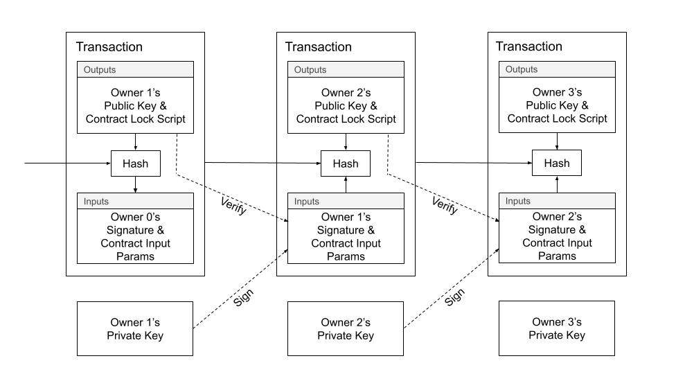
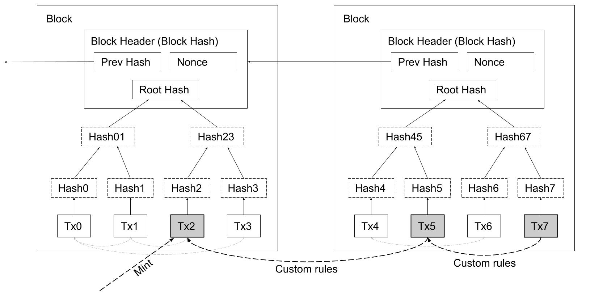
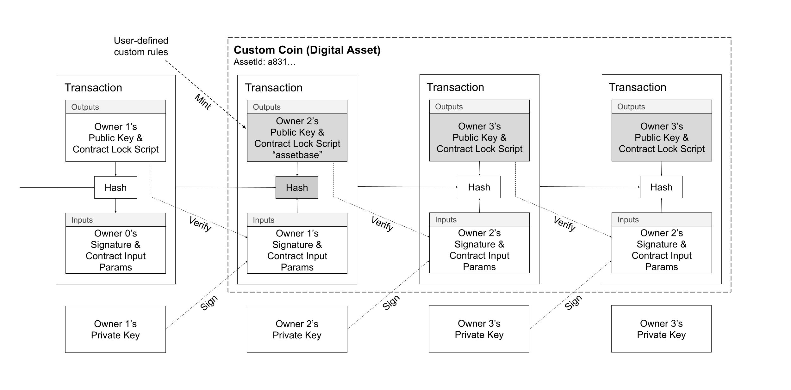
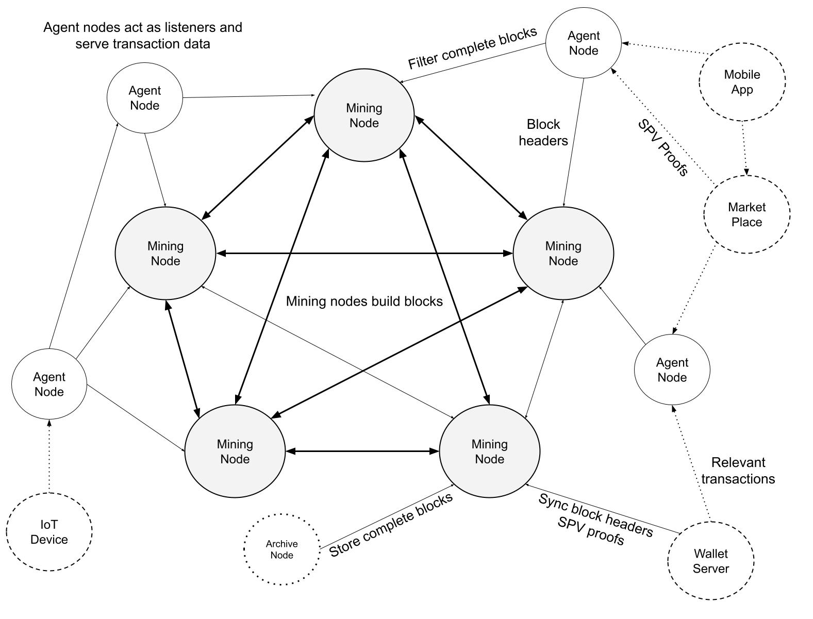

# Radiant: A Peer-to-Peer Digital Asset System

The Radiant Developers

August 11, 2022

radiantblockchain.org

**Abstract.** The Radiant network is a peer-to-peer digital asset system that enables direct exchange of value without going through a central party. The original Bitcoin[1] protocol provides what is needed to create a peer-to-peer electronic cash system, but lacks the ability to verify transaction histories and therefore, cannot be used to validate digital assets. Digital signatures and output constraints provide part of the solution, but the main benefits are lost if a trusted third party is still required to validate digital assets. Similarly to Bitcoin, the Radiant network requires minimal structure, and timestamps transactions into an ongoing hash-based chain of proof-of-work. We introduce two techniques to validate digital assets: unique references and a general purpose induction proof system both of which operate in constant O(1) time and space. It is possible to compose outputs in any manner, without compromising the inherent parallelism and performance characteristics of an unspent transaction output (UTXO) based architecture. Therefore, users can leave and rejoin the Radiant network at will and be assured of the integrity and authenticity of their digital assets.

# 1. Introduction  

Commerce with blockchains, or digital ledger technology (DLT), in many cases relies on issuers and custodians serving as trusted parties to authenticate digital assets. While those systems work well enough for electronic payment-like transactions, they still suffer from the inherent weaknesses of the trust based model for advanced uses. The Ethereum Virtual Machine (EVM) [2] based blockchains are very flexible for all kinds of programs, but the high fees makes use for micropayment applications impractical.

What is needed is an electronic payment system that can be used for digital asset management system with low fees, high performance, and advanced programming capabilities. In this paper, we propose a solution to the problem of blockchain scaling and contracting using two novel techniques which provide unique references and a general induction proof system, which makes Turing Complete [3] programs across transaction boundaries possible. The system proposed is decentralized, uses a proof-of-work consensus mechanism like Bitcoin, but with significantly higher levels of throughput, while providing the same flexibility of EVM-based blockchains, with very low fees.

# 2. Transactions

Similar to Bitcoin, we define an electronic coin as a chain of digital signatures. Where transactions in Radiant differ is that each owner transfers the coin to the next by digitally signing a hash of the previous transaction in addition to the required input params to unlock the coin. A transaction also creates new output locking constraints, which may include the public key of the next owner, amongst any other rules defined by the user.

>**Diagram 1.** Radiant Transactions. 
 

To verify that a double-spend did not occur, we use a distributed timestamp server, using a hash-based proof-of-work system to organize the canonical history to determine which transaction arrived first. The transactions are organized into blocks. As a matter of convention, the first transaction, called a "coinbase transaction", in a block is a special transaction that starts a new coin owned by the creator of the block. Blocks are chained together and organize transactions into a Merkle Tree [4]. All transactions, with the exception of the first, must reference a previous transaction forming a directed acyclic graph (DAG) where all coins eventually connect back to at least one of the special transactions at the beginning of a block.

>**Diagram 2.** Block Structure; transactions are organized into a Merkle Tree.
 

The problem with this design, in the context of digital assets, is that there is only one type of coin, or digital asset, and no concept of user-defined coins (or digital asset types). The design works well enough for electronic payment-like transactions in the native unit of account, however it does not immediately lend itself to be used for other types of coins or digital assets. A common solution is to introduce a service such as a transaction indexer which monitors transactions for special data sequences to signify the creation of a digital asset. The problem with this solution is that it depends on the company running the service, with digital asset authenticity needing to be trusted, just like any other service on the web.

We need a way for the users to indicate the creation of custom coin types, but not rely on a trusted service to be used for data presentation.
 
# 3. Digital Assets

We define a custom electronic coin, or digital asset, as a chain of digital signatures. A digital asset is a user-defined coin type using a special transaction marker, called an "assetbase transaction", to create or mint a digital asset. Similar to coinbase transactions, which inject new coins into the system, the assetbase transaction colors or tags the electronic coin with a unique 36-byte identifier for it's lifetime. The custom electronic coin is overlayed on top of the base coin type and functions in a similar manner. The assetbase transaction can appear anywhere in the block and may enforce any custom rules and constraints decided upfront.

>**Diagram 3.** Transactions representing user-defined coin types &mdash; or digital assets. 
 

To accomplish this we need to create a stable unique identifier and a transaction mechanism to track the authenticity of the coin type (digital asset). The users of the system need to have proof that custom coin types are not forgeries and accurately represent the digital assets.

>**Diagram 4.** Custom user-defined coin types are defined from a special mint transaction. A unique identifier is used to classify the coin type.
 

# 4. Unique Identifiers

To implement a unique identifier for a coin type, we use a special marker transaction, called "assetbase transaction", which acts as the start (mint) of the chain of digital signatures. Rather than require a new data-structure for the unique identifier, we reuse the transaction identifier and output index, called an "outpoint", as the unique identifier for the coin type. It is assured that outpoints (36-bytes) are random and globally unique.

A programming instruction, called `OP_PUSHINPUTREF`, is used to attach a reference to an output. The instruction accepts exactly one 36-byte parameter which must match either 1) the outpoint of one of the outputs being spent, or 2) the same 36-byte value already appears in a previously specified `OP_PUSHINPUTREF` in one of the outputs being spent. The only way for any given value to appear in a transaction output is that, through some ancestor transaction, it matched the outpoint from the initial minting assetbase transaction. Transactions that specify a value which do not meet either condition are invalid.

>**Diagram 5.** Unique identifiers are initialized by matching an outpoint of one of the outputs being spent, and then maintained as long as at least one of the outputs being spent contains the same unique identifier in the script body.
 

This simple programming instruction provides a unique identifier which can be used as a stable reference to create advanced rules. For example, different coin types, digital assets, can now depend on other coin types. Since all of the data is local to the transaction, via it's immediate parent input transactions, it is easy for clients and services to validate the authenticity of a digital asset in O(1) constant time and space, avoiding the need for a trusted service.

# 5. Proofs By Induction

It is possible to create unique identifiers in an alternative manner and also provide a mechanism for mathematical induction [5] proofs using a modified transaction hash algorithm. By allowing input scripts to accept the parent transaction being spent, the rules can verify that the parent, and it's grand-parent conform to the required rules. The obvious problem is that as each full copy of the parent transactions are embedded, an exponential size explosion occurs and prevents the practical use of the technique. What is needed is a way to compress the transaction, so that a fixed sized data-structure can be used instead to derive the transaction hash, instead of requiring the full transaction contents.

>**Diagram 6.** Full parent transaction validation, mathematical induction proof by embedding the full parent transactions into the inputs resulting in exponential transaction size increase.
 

We can accomplish it by modifying the transaction hash algorithm used in Bitcoin, wherein a double sha-256 digest is calculated from the serialized transaction, into a new version that first summarizes the transaction contents to derive the hash.  We introduce transaction hash algorithm version 3, to distinguish it from the use of version 1 and version 2 in Bitcoin. The process is to hash each field, or component of a transaction, to an intermediate hash, which can be used as a fixed size input and thereby avoid the exponential transaction size growth.

We use the following 112-byte data-structure, instead of the complete serialized transaction bytes, which in turn is double sha-256 hashed to finally obtain the transaction hash.

Transaction Version 3 Hash Preimage Fields:
> 1. nVersion(=3) of the transaction (4 byte little endian)
> 2. nTotalInputs (4 byte little endian)
> 3. hashPrevoutInputs (32 byte hash)
> 4. hashSequence (32 byte hash)
> 5. nTotalOutputs (4 byte little endian)
> 6. hashOutputHashes (32 byte hash)
> 7. nLocktime of the transaction (4 byte little endian)

By using the transaction hash algorithm for version 3 transactions, we are able to embed the parent and grand-parent transaction in each step of a mathematical induction proof to prevent transaction size increase, and can enforce any rules needed.

>**Diagram 7.** Compressed parent transaction validation, mathematical induction proof by embedding the transaction hash version 3 preimage data-structure of the parent and grand-parent to enforce arbitrary rules and constraints.
  
 
# 6. Network

The network topology is a nearly complete graph, wherein every Mining Node is connected to every other Mining Node. The steps to run the network are the same as Bitcoin, with some distinctions for different node types: Mining Nodes, Agent Nodes, Archive Nodes. Mining Nodes are the active publishers of blocks and maintain consensus with all other nodes, Archive Nodes serve historical block data, and Agent Nodes are designed to filter blocks and track transactions of interest to the applications they serve. Archive and Agent Nodes may operate on the same peer-to-peer network and yet do not produce blocks. The non-Mining Nodes such as Archive and Agent Nodes are sometimes referred to as "listener nodes" to distinguish their role in the network.
 

>**Diagram 8.** Mining Nodes are well-connected and build on top of each other's blocks. Archive nodes store complete blocks for historical analysis and bootstrapping purposes. Agent nodes are listener nodes which filter and store transactions to serve clients.
 

Mining Nodes are well-connected into a nearly complete graph between other Mining Nodes. Their job is to build on top of each other's blocks and maintain consensus for the most recent few hundred blocks, and maintain the UTXO set for the prevention of double-spending. 

Agent Nodes only need to store a subset transactions, for example, a specific coin type or digital asset. Even with large blocks, an Agent Node can quickly filter transactions by references or specific byte-sequences, then store those transactions to serve via an application programmer interface. Between cooperating agents, a Merkle Tree root hash can be publicly announced for the transactions in each block that match a pre-determined pattern to signal to other Agents and consumers which transactions that Agent has processed.

Archive Nodes are used to create backup copies of entire blocks for various applications including data warehousing, analytics and machine learning. Since Archive Nodes are not involved directly in mining, they do not have the same real-time performance and bandwidth requirements as Mining or Agent Nodes.

# 7. Calculations

We consider the scenario where the Radiant network continues to grow and what it entails for the processing requirements of Mining, Archive and Agent Nodes. For comparison, at the time of writing, there are about 83 million unspent transaction outputs for the Bitcoin blockchain, for a total of about 6 GB of necessary data to prevent double spends. It is only necessary that the most recent few hundred blocks are kept by Mining Nodes, with older blocks being available from Archive Nodes. For Agent Nodes, it is necessary to keep the relevant partition of unspent transaction outputs that pertain to the applications they serve, scaling is a function of bandwidth and not storage requirements.

For our purposes, we assume that there will be 3 GB sized blocks every 5 minutes to be timestamped and distributed across the network, or about 20,000 transactions per second with the average transaction size of 500 bytes, or about 6,000,000 transactions per block. We show that for each type of node, the network is able to adequately scale to meet global demand. This equals about 1 transaction every 5 days for each of the 8 billion people on the planet.

### Mining Nodes

Mining Nodes are the only node type which build on top of each other's blocks. To maintain consensus, it is sufficient to synchronize the unspent transaction output (UTXO) set, and only maintain about the last hundred blocks. At the time of writing, high performance commodity solid-state drives are capable of achieving upwards of 120,000 IOPS, costing about $500 USD for 280 GB, and can therefore handle about 20,000 transactions per second (assuming each transaction has 2 inputs and 2 outputs). There are 2 reads for inputs, 2 updates to the inputs, and 2 writes for the new output: 120,000 / 6 = 20,000 transactions/second.

### Archive Nodes

Archive Nodes provide historical block data and are suitable for machine learning, analytics, and data warehousing applications. The Archive Nodes may supplement bootstrapping of Mining Nodes and to run periodic consistency checks on the UTXO set. At the time of writing, commodity hard disks of 18 TB are available for about $350 USD. Assuming 3 GB of data every 5 minutes equals 732 GB of data storage requirement per day, or about 22 TB per month. The hardware cost for a year is 15 hard drives, with 18 TB capacity, for a yearly incremental cost of $5,000 USD.

### Agent Nodes

Agent Nodes scale most easily amongst the node types because they only process the relevant transaction types for the applications they serve. As a result the Agent Nodes can range from a web server to a lightweight IoT device with limited processing and storage capabilities, and yet still keep peace with 3 GB blocks, or 20,000 transactions per second. For example, a company may wish to track the usage of it's loyalty points, created as a digital asset, and therefore only need to select a small subset of transaction updates from each block that match the unique identifier for that coin type.

At the time of writing, a commercial computing device, Raspberry Pi 4, sells for about $275 USD which has a quadcore 1.5 GHZ processor and 4 GB of RAM, which can be used to quickly filter, and discard irrelevant transactions, at a rate of 5,000 transactions per core. Of course, this is just an example of how reasonable it is to process large blocks, in a typical web application may have many more cores available.

The median bandwidth speed of the top 25 countries exceeds 100 MBPS, or about 10 MB/second download, with many internet service providers offering unlimited downloads. The bandwidth requirements for 3 GB blocks every 5 minutes is about 10 MB/second for a total of 22 TB per month. Hierarchies of Agent Nodes can also be created to filter down the total bandwidth requirements for Agent Nodes with lower bandwidth capacity.

# 8. Conclusion
 
We have proposed a system for digital asset management without relying on trust. We started with the basic building blocks of coins made from digital signatures, which provides strong control of ownership. From the needed rules and incentives, we introduced two novel methods for authenticating and tracking digital assets in constant O(1) time and space. Both methods independently provide a general mathematical induction proof system which can encode any possible digital asset configuration. The system is Turing Complete within and across transaction boundaries, without need for secondary layers. Radiant is a breakthrough design which provides the performance and paralellism benefits of an unspent transaction output (UTXO) blockchain, but with the contracting ability of account-based blockchains based on the Ethereum Virtual Machine (EVM).

# References

[1] Satoshi Nakamoto, "Bitcoin: A Peer-to-Peer Electronic Cash System" URL https://bitcoin.org/bitcoin.pdf, 2009.
 
[2] Vitalik Buterin, "Ethereum: A Next-Generation Smart Contract and Decentralized Application Platform." URL https://ethereum.org/en/whitepaper/, 2014.

[3] Wikipedia contributors. "Turing completeness." Wikipedia, The Free Encyclopedia. Wikipedia, The Free Encyclopedia, URL https://en.wikipedia.org/wiki/Turing_completeness, 21 Jul. 2022

[4] R.C. Merkle, "Protocols for public key cryptosystems," In Proc. 1980 Symposium on Security and Privacy, IEEE Computer Society, pages 122-133, April 1980.

[5] Britannica, T. Editors of Encyclopaedia. "mathematical induction." Encyclopedia Britannica, URL https://www.britannica.com/science/mathematical-induction, 2018

 